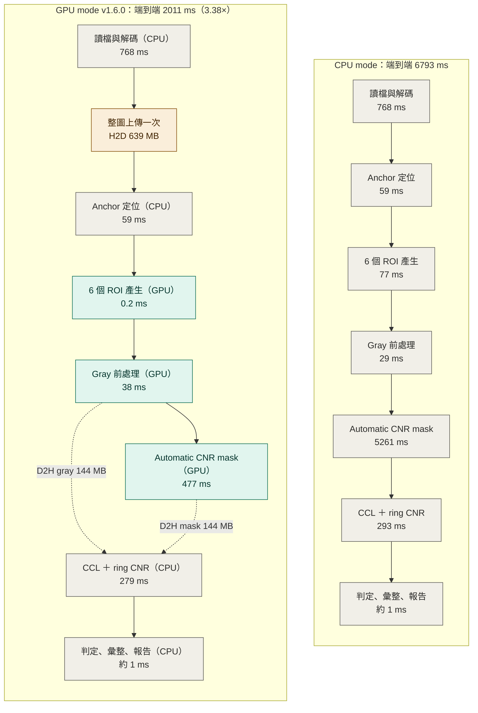

# VisionFlow CUDA DLL

`visionflow_cuda.dll` 是 VisionFlow AOI 的可選 CUDA backend。CPU executor 是 OpenCV
正確性基準；CUDA 必須保留 recipe、PASS/NG、座標、defect metadata 與輸出語意。
`gpu.mode: auto` 可在 CUDA 失敗時整個 detector 回到 CPU，`gpu.mode: cuda` 則禁止
隱藏 fallback。

## 架構

Detector 以 `core/preprocess_plan.py` 的 backend-neutral operators 描述前處理。
CUDA backend 支援：

- ABI v1 stateless primitives。
- Persistent context、grow-only buffers 與 non-blocking stream。
- Detector-neutral linear `VfPlanDescV1`。
- Shared-gray/multi-output `VfDagPlanDescV1`。
- Resident image/ROI 與 coordinate ROI batch。
- `VfCudaTimingsV1` CUDA event 分項。
- 舊版 `vf_preprocess_401_2_u8` compatibility adapter。

Gaussian kernel 3/5/7/9 使用與 OpenCV 相同的固定係數，其他 kernel 使用 OpenCV
自動 sigma 規則；全部 kernel 都以相同的 8-bit fixed-point 誤差擴散與兩階段
rounding 執行。BGR→Gray 使用 OpenCV 8-bit 路徑相同的 15-bit BT.601 fixed-point
係數，避免 ±1 灰階差異在 threshold 後放大成 binary mask 差異。

`Resize(area)` 只支援兩軸不放大的單通道縮小，並逐分支重現 OpenCV `INTER_AREA`：相同尺寸
copy、2×2 `(sum+2)>>2`、其他整數倍 float 平均，以及非整數倍的 `computeResizeAreaTab`
權重表與 half-even 捨入；權重表在 plan create 時上傳一次。`cuda_project.json` 的
`nvcc.fmad: false` 讓 build script 傳入 `--fmad=false`，避免 GPU 將乘加融合成 FMA 而破壞
float 累加的逐像素一致性，不可移除。

`gpu.mode: auto`（允許 CPU fallback）時，`PlanCrossoverPolicy` 會對每個前處理 plan 與輸入
尺寸實測數次 CUDA 與 CPU 後凍結較快的後端；小 tile 或便宜 operator 可能改走逐像素相同的 CPU
plan，tile metadata 以 `cpu_crossover` 路線與 `preprocess_routes` 標示。`gpu.mode: cuda`
不啟用此路由。

## 已完成並接入產線、以及尚未接入的步驟

以 RTX 3090 完成等價量測後才可接入產線；未接入者在 `execution.gpu.device_host_split` 中
一律回報為 cpu。**接入與否以本節與 `Todo.md` 為準，不以 export 存在為準。**

- `vf_match_template_gray_u8`（Template Anchor Grid 定位）：**已接入**完整 pipeline（v1.6.1 起，
  v1.6.0 之後修正；v1.6.0 發行檔因 resident 模式 Tiler 拿不到 runtime 而實際走 CPU，詳見
  〈v1.6.0 後：anchor 接線修正〉）。正式尺寸 pipeline 內 median 3.29 ms（CPU 參考 6.95 ms）。
  Tiler 層級量測：與 `cv2.matchTemplate` 的定位座標在 9 個場景 9/9 相同、分數差 ≤ 4.2e-7、
  逐次執行決定性；形狀界線內（template 每邊 ≤ 128 px 且搜尋面積 ≥ 256×256）比 CPU 快
  1.6～3.9 倍，界線外或失敗時回 CPU 參考；界線見 `core/tiler.py` 的 `gpu_anchor_shapes_supported`。
- `vf_find_contours_u8` / `vf_find_contours_download`（輪廓抽取）：**正確且已改善，但尚未全面勝過 CPU，
  因此不接入產線**。與 `cv2.findContours(RETR_LIST/RETR_EXTERNAL,
  CHAIN_APPROX_SIMPLE)` 在 `tools/check_contour_equivalence.py` 的 **314 個案例全部逐點
  相同且決定性**（含輪廓數、每條 shape、點順序、子區域座標契約）。**warp 改善前在每一個量測
  形狀都慢於 cv2**（GPU／CPU 毫秒）：512×512 稀疏 0.24→1.06（0.22×）、512×512 密集
  0.23→3.91（0.06×）、2048×2048 密集 3.04→23.17（0.13×）、2000×12000 稀疏
  13.77→34.16（0.40×）、中型 18.63→136.54（0.14×）、大型 26.97→261.85（0.10×）、
  `RETR_EXTERNAL` 13.83→1234.75（0.01×）。這是 warp 改善前的完整 enablement matrix；目前仍不訂
  啟用界線、維持停用。2026-09-15 把 `RETR_LIST` 每一步序列讀取 8 鄰域改成 warp 同時讀取、只由
  lane 0 寫標記與點，舊／新 DLL 各暖機後 15 次 A/B：高 12000×寬 2000 的稀疏長輪廓
  **37.08→29.89 ms（減少 19.4%）**、密集短輪廓 **8.93→8.00 ms（減少 10.4%）**，314/314
  逐點相同。稀疏長輪廓仍慢於 cv2，`RETR_EXTERNAL` 也仍是序列 byte 掃描，故尚不能接入 Detector。
- `vf_cnr_mask_f32`（residual 門檻與候選遮罩一次算完）：**已接入** `detectors/detector_202_1.py`
  的 `_residual_statistics`。它把 `residual` 與 `|residual − median|` 都建在 device 上，用與
  `vf_median_f32` 相同的 key／排序機制取兩個中位數、以 double 算門檻、再以 **float32** 比較
  （NumPy 拿 float32 陣列比 Python float 時會把純量窄化，所以比較必須在 float32），
  只回傳 3 個純量與一張 uint8 遮罩，因此這兩個運算元**不會**再各自上傳一次。
  **等價是精確的**：623 個案例中 `residual_median`／`mad` **逐位元相同**、
  `threshold` **double 完全相等**、遮罩**逐位元組相同**，零不符、零差異像素；
  決定性、不改動輸入，16 種非法參數全部拒絕且不留下痕跡。
  驗收工具含一個**門檻進位探針**：證明若比較寫成 double 會得到 4 個亮點而正確答案是 2 個。
  **效果**：2000×12000 ROI 由 271.7 ms 降到 **41.5 ms**（含 183.1 MiB H2D／22.9 MiB D2H）；
  接線後 202 的 `automatic_cnr_mask` 由 528.3 降到 **471.8 ms**，產線形狀端到端 **1.26×**，
  且 decision-bearing 欄位完全相同。報表另以 `metadata.residual_backend`
  （`numpy_cpu`／`cuda_f32`）標示這一段走哪條路。
- `vf_gaussian_blur_f32` / `vf_gaussian_blur_f32_roi`（float32 Gaussian，供 202-CS-SN-1 的
  CNR 背景）：**已接入** `detectors/detector_202_1.py` 的 `_background_blur`，需同時具備
  `supports_gaussian_blur_f32` 與 `supports_gaussian_f32_sigma`；缺 export、舊版 DLL 或任何
  device 錯誤都整段回 `cv2.GaussianBlur`。sigma 語意與 OpenCV 相同（`sigma>0` 直接使用、
  `sigma<=0` 走自動規則、NaN／±inf 拒絕），係數對 `cv2.getGaussianKernel` 在 441 組
  (ksize, sigma) **位元相同**；1008 個 sigma 掃描案例 worst `max|diff|` 7.629e-05
  （claimed 4.0e-04）、`mean|diff|` 3.052e-05（claimed 5.0e-05）。
  **語意差異（必須揭露）**：device 的加法順序與 OpenCV 不同，因此 `residual` 尾位漂移，
  `mad`／`residual_median`／`residual_threshold`／`robust_noise_sigma` 四個診斷值會有
  約 1e-5 的差異（202 矩陣最大 3.4e-05），其餘 40 個 metadata 欄位完全相同。
  **判定不受影響**：47 個場景的 PASS/NG、缺陷數、結構欄位皆相同，且**候選遮罩 47/47 位元相同**。
  報表會以 `metadata.background_backend`（`opencv_cpu`／`cuda_f32`）與
  `metadata.background_precision_note` 明確標示該次執行用的是哪一條路徑。
  **效能**：單獨呼叫沒有收益（4000×2000 ksize=51 為 13.5 vs 13.8 ms，H2D＋D2H 佔 96%），
  但 **kernel 本體只有 0.606 ms**；接線後 202 的 `automatic_cnr_mask` 836.6 → 438.8 ms，
  產線形狀端到端 1337 → 1019 ms（**1.31×**）。真正的大幅收益需把 residual 留在 device。
- **connected components 與 ring CNR 統計**：**尚未 GPU 化**。`tools/connected_components_reference.py`
  與 `cv2.connectedComponentsWithStats` 在 **4 連通完全等價**（含標籤編號；10 種形狀 × 3 密度 × 3 seed
  共 90 個案例逐位元斷言相等），8 連通則**只差標籤編號**（component 集合與 stats 在所有案例相同）。
  **原本這使 GPU CCL 無法替換**，因為 `Detector202_1` 的候選排序在 CNR 完全相同時會沿用標籤順序；
  **該依賴已移除**：候選現在以 `(-cnr, bbox.y, bbox.x)` 排序，輸出的缺陷順序與 CCL 編號無關
  （`tools/cnr_label_order_impact.py` 以 100 次隨機標籤置換驗證 100/100 相同）。
  量測顯示產線形狀的雜訊表面 **0/121** 個候選會落在平手群，因此此改變在產線上無影響。
  **所以 GPU CCL 只需與 OpenCV 一致到「component 集合＋每個 component 的 stats」**，
  不再需要重現 OpenCV 的編號。ring CNR 的背景 mean/std 目前仍以 NumPy 在 host 計算。

`vf_match_template_debug_*` 與 `vf_find_contours_*` 的下載介面只供等價驗證與診斷使用，
不屬於產線路徑。

## 新 GPU mode：接手紀錄與正式尺寸基準

本節是新 GPU mode 的持續接手紀錄。後續每個實驗都必須記下測試圖形、命令、
CPU/GPU median 與 P95、加速倍數、傳輸量、等價結果、是否接線，以及未採用方案的原因。

### 2026-09-15 正式尺寸修正與優化前 baseline

使用者確認的幾何是原圖 **寬 16384、高 13000**，其中有 6 個 **高 12000、寬 2000**
的 ROI；舊紀錄中高 2000、寬 12000 的量測方向不適用於此目標。基準工具
`tools/benchmark_pipeline_production.py` 已改成：

- 以固定 seed 生成 16384×13000 BGR BMP（解碼後 638,976,000 bytes）。
- 在 `(x, y)=(500,500)` 起放一列 6 個 2000×12000 ROI，水平間距 100 px。
- 生成 64×64 template anchor，讓 CPU/GPU 都走正式 anchor grid；GPU 由 resident 原圖定位與切 ROI。
- 一個 `GpuExecutionSession` 跨 warm-up 與量測重用；CPU/GPU 交錯執行以降低順序偏差。
- 正式命令：

```powershell
.\env\Scripts\python.exe tools\benchmark_pipeline_production.py `
  --profile production --warmup 1 --repetitions 3 `
  --work outputs_validation\gpu_mode_goal\production --keep `
  --json outputs_validation\gpu_mode_goal\production_baseline.json
```

RTX 3090、CUDA 13.3、Detector `202-CS-SN-1` 的優化前結果：

| 範圍 / 階段 | CPU median ms | CPU P95 ms | GPU median ms | GPU P95 ms | CPU/GPU 倍數 |
|---|---:|---:|---:|---:|---:|
| Pipeline end-to-end | 6282.0 | 6409.9 | 3243.9 | 3289.0 | **1.94×** |
| detectors total | 5234.5 | 5339.8 | 2159.8 | 2188.1 | **2.42×** |
| automatic CNR mask | 4823.6 | 4932.9 | 1735.4 | 1782.0 | **2.78×** |
| connected components + ring CNR | 307.0 | 308.7 | 288.8 | 317.6 | 1.06× |
| detector preprocess | 30.3 | 31.5 | 45.4 | 49.1 | 0.67× |
| tiling total | 140.7 | 145.3 | 63.0 | 67.8 | 2.23× |
| image load | 748.2 | 761.9 | 753.2 | 772.6 | 0.99× |

結果為 NG、6/6 NG tiles、558 defects；3/3 次的 PASS/NG、defect 數、type、bbox、area、
confidence 與判定相關 metadata 全部相同，這張合成圖的 residual diagnostics 也無漂移。

目前資料路徑：CPU 解碼後將 638,976,000-byte BGR 原圖上傳一次；ROI 與 gray preprocess 使用
resident device image（原紀錄也列 anchor localization，經查證 anchor 實際在 CPU，見〈v1.6.0 發行版〉），但 candidate extraction、component/ring 統計、
PASS/NG 與報表仍在 CPU。202 automatic CNR 尚未真正 resident：每次六個 ROI 又經
`vf_gaussian_blur_f32` 上傳 576 MB／下載 576 MB，並經 `vf_cnr_mask_f32` 上傳 1,152 MB／
下載 144 MB。因此每次 pipeline 除整圖一次上傳外，這兩個舊介面仍造成約 **1.73 GB H2D +
720 MB D2H**。下一個實作項目是 resident ROI 的 fused gray/float Gaussian/residual/median/MAD/mask
export，只下載候選 mask與必要純量；完成後需重編 `visionflow_cuda.dll`、做 CPU/GPU 等價矩陣，
再以同一命令產出改動後表格。`findContours` 因產線尚未接線且 GPU 對稀疏長輪廓仍慢於 CPU，
不是本輪第一優先。

### 2026-09-15 resident 202 CNR 完成後

新增 optional ABI-v1 export `vf_cnr_mask_u8_roi`。它直接讀取 `vf_context_upload_u8` 保存的
resident 原圖 ROI，在 device 上依序完成 OpenCV 等價 BGR→uint8 gray→float32、Gaussian、
residual、exact median、MAD、threshold 與 candidate mask，只下載 mask 與三個純量。Detector
在 `export_debug_images=False` 時優先使用此路徑；debug 模式為了產生 residual 圖保留原路徑；
舊 DLL、缺 export、尺寸不符或 device 錯誤會回到既有 host-operand GPU/CPU 路徑。

獨立驗收命令：

```powershell
.\env\Scripts\python.exe tools\cnr_mask_u8_roi_equivalence.py
```

15/15 個案例（1/3 channels、非零 ROI offset、kernel 3/31/51、sigma 0/1.25，並含 3 次
高 12000×寬 2000）與既有 `vf_gaussian_blur_f32`→`vf_cnr_mask_f32` 的 median/MAD/threshold/mask
逐位元相同，且 15/15 candidate mask 與 CPU OpenCV 參考逐 byte 相同。相對 CPU 的診斷浮點
最大差異維持既有 Gaussian 容差：median 1.145e-5、MAD 7.630e-6、threshold 3.394e-5；
不影響 mask。高 12000×寬 2000 單一 resident export median **10.98 ms**。

同一張 16384×13000／6 ROI 合成圖、同一基準方法的改動前後比較：

| 指標 | 改動前 GPU | resident GPU | 改善 |
|---|---:|---:|---:|
| Pipeline median | 3243.9 ms | **2022.2 ms** | **1.60× / -37.7%** |
| Pipeline P95 | 3289.0 ms | **2214.3 ms** | 1.49× / -32.7% |
| 對同輪 CPU 的端到端倍數 | 1.94× | **3.26×** | +1.32× |
| detectors total median | 2159.8 ms | **923.0 ms** | **2.34× / -57.3%** |
| automatic CNR median | 1735.4 ms | **526.1 ms** | **3.30× / -69.7%** |
| 每次 pipeline H2D | 2366.976 MB | **638.976 MB** | **-73.0%** |
| 每次 pipeline D2H | 864 MB | **288 MB** | **-66.7%** |
| 每次 native calls | 19 | **13** | -31.6% |

改動後正式量測 CPU median/P95 6595.6/6703.3 ms、GPU 2022.2/2214.3 ms，3/3 次仍為
NG、6/6 NG tiles、558 defects，所有判定欄位相同且此圖診斷值也無漂移。完整 JSON：
`outputs_validation/gpu_mode_goal/production_resident.json`。目前剩餘 D2H 是 144 MB gray
（CPU ring CNR 統計使用）與 144 MB candidate mask（CPU connected components 使用）。下一個
可量化上限是 `connected_components_and_cnr` 約 285 ms；必須先證明 GPU CCL＋ring 統計在
高瘦 ROI 上快於這個 CPU 路徑，才接線，避免重演 `findContours` 雖正確卻更慢的情況。

### 2026-09-15 GPU connected components 實驗：不接入產線

實驗版以 CUDA atomic union-find、root 壓縮、CUB prefix scan 與 atomic stats 實作 4/8-connectivity
CCL。合成遮罩及一張正式 benchmark 候選遮罩的 component 數量、像素集合與 stats 都和 OpenCV
相同；但它的輸入仍是已下載到 host 的 candidate mask，輸出又要下載整張 int32 label map。
因此單看 kernel 有改善，放回完整 pipeline 後幾乎沒有收益。

| 指標 | resident GPU（CPU CCL） | 實驗 GPU CCL | 差異 |
|---|---:|---:|---:|
| Pipeline median | 2022.2 ms | 2014.0 ms | **8.2 ms / 0.4%** |
| Pipeline P95 | 2214.3 ms | 2032.6 ms | 181.7 ms；跨輪溫度/快取波動較大 |
| connected components + ring median | 288.85 ms（CPU） | 265.76 ms（GPU CCL + CPU ring） | **1.09×** |
| 每次 pipeline H2D | 638.976 MB | 782.976 MB | **+144 MB** |
| 每次 pipeline D2H | 288 MB | 864.011 MB | **+576.011 MB** |
| 每次 native calls | 13 | 19 | +6 |

同一個 12000×2000 mask 的獨立交錯量測曾得到 GPU median 33.38 ms、CPU 58.54 ms（1.75×），
但另一輪 CPU-only 是 35.79 ms，證明該微基準受排程／快取影響，不能取代完整 pipeline 結果。
完整 pipeline 實驗 JSON 為 `outputs_validation/gpu_mode_goal/production_ccl.json`；它仍維持 3/3
判定完全相同、558 defects。由於端到端 median 只改善 0.4%，並破壞低傳輸目標，實驗 export、
runtime binding 與 detector 路由已撤回，正式版本維持 OpenCV CCL。這和先前 `findContours` 的
結論一致：不能只因工作能在 CUDA 執行就接線，必須以完整 pipeline 淨收益判斷。

若日後重做 CCL，啟用條件是 candidate mask 在 CNR export 後繼續留在 device，且 GPU 同時完成
ring 統計，只下載少量候選 bbox/area/CNR；不能再下載 96 MB/ROI 的 int32 label map。還必須重現
OpenCV 可觀測的 label 編號順序，或先明確修改並驗證排序契約。這才可能同時減少 144 MB mask
D2H、避免 144 MB mask H2D，並讓 CCL 的 kernel 加速反映到端到端時間。

### 2026-09-15 最終重編與驗收

撤回 CCL 實驗後，以 CUDA 13.3、Visual Studio 2026、`sm_86` 重新編譯 DLL，並用重編成品重跑
一輪 warm-up 加三輪交錯 CPU/GPU 正式 benchmark。這是交接時應採用的最終數字：

| 範圍 | CPU median / P95 | GPU median / P95 | median 倍數 |
|---|---:|---:|---:|
| 完整 pipeline | 6504.0 / 6665.2 ms | **2097.0 / 2123.5 ms** | **3.10×** |
| detectors total | 5451.2 / 5614.1 ms | **970.9 / 1024.1 ms** | **5.61×** |
| automatic CNR mask | 5035.9 / 5213.2 ms | **571.3 / 609.9 ms** | **8.81×** |
| connected components + ring | 305.8 / 307.5 ms | 287.6 / 299.4 ms | 1.06×（兩邊皆 CPU） |
| tiling | 152.5 / 159.1 ms | **62.7 / 63.1 ms** | **2.43×** |

三輪 CPU/GPU 都是 NG、6/6 NG tiles、558 defects，PASS/NG、defect count/type/bbox/area/
confidence 與判定 metadata **3/3 完全相同**；此圖的 residual diagnostics 也沒有漂移。GPU 每輪只有
一次整圖 upload：H2D 638.976 MB；D2H 288 MB（六張 gray 加六張 candidate mask）；共 13 次
native calls。實際 split 是 decode、anchor、CCL/ring、PASS/NG 彙整在 CPU；resident upload、ROI、
preprocess 與 automatic CNR mask 在 GPU。（原紀錄寫 anchor 在 GPU，經 v1.6.0 驗收查證更正：
GPU 呼叫統計沒有 `vf_match_template_gray_u8`，anchor 時間也與 CPU 相同，見下一節。）證據：
`outputs_validation/gpu_mode_goal/production_final.json`。

最終驗證結果：

- `gpu/test_cuda_api.exe`：RTX 3090 / compute capability 8.6，C ABI、plan、resident ROI、batch smoke 通過。
- `tools/cnr_mask_u8_roi_equivalence.py`：15/15 與 chained GPU 逐位元相同、15/15 CPU mask 相同；
  12000×2000 resident export median 11.139 ms。
- `gpu/validate_cuda_dll.py --warmup 5 --benchmark 20 --crossover --morphology-profile
  --stress 10 100 1000 --resize-area-pipeline`：全部 requested CUDA validations 通過。
- `gpu/validate_cuda_fault_injection.py --vram-pressure`：init failure、kernel launch error、device OOM、
  sticky context 與 VRAM pressure 全部通過並能依契約 fallback／恢復。
- `python -m unittest discover -s tests -v`：435 tests 通過；compileall 與 CUDA preflight 通過。
- CLI 合成 NG smoke 正常完成並寫出 overlay、NG tile、CSV、matrix CSV 與 JSON；CLI exit 1 代表檢出
  NG，是既有命令列結果契約。

### 2026-09-15 v1.6.0 發行版：全流程各階段對照與兩種 mode 流程

v1.6.0 發行前以 release commit 的 CUDA 原始碼重新編譯 DLL（CUDA 13.3、MSVC x64、`sm_86`），
再用發行成品 DLL 重跑同一正式尺寸基準。這是 v1.6.0 對應的數字；和上一節的差異屬於跨輪波動
（CPU 6504→6793 ms、GPU 2097→2011 ms），判定結果相同。

```powershell
.\env\Scripts\python.exe tools\benchmark_pipeline_production.py `
  --profile production --warmup 1 --repetitions 3 `
  --json outputs_validation\release_v1.6.0\production_benchmark.json
```

條件：RTX 3090、16384×13000 合成圖、一列 6 個高 12000×寬 2000 ROI、`202-CS-SN-1`，
warm-up 1 輪＋量測 3 輪。單位 ms。縮排的「└」列是上一列的子階段，不另外加總。

| 階段 | CPU median | CPU P95 | GPU median | GPU P95 | 倍數 | GPU mode 實際位置 |
|---|---:|---:|---:|---:|---:|---|
| **端到端** | **6792.8** | 7174.1 | **2011.1** | 2023.4 | **3.38×** | 混合 |
| 讀檔與解碼 `image_load` | 767.5 | 857.1 | 767.9 | 794.9 | 1.00× | CPU |
| Recipe 設定 `recipe_setup` | 90.1 | 95.9 | 92.8 | 93.8 | 0.97× | CPU |
| 初始化 `initialization` | 0.1 | 0.1 | 199.3 | 200.1 | — | 推定含 CUDA 初始化與整圖上傳 |
| Tiling 合計 `tiling` | 135.6 | 148.6 | 58.9 | 61.9 | 2.30× | 混合 |
| └ Anchor 定位 `template_match` | 58.8 | 59.5 | 58.7 | 61.6 | 1.00× | CPU（resident 模式未接上 GPU anchor，見本節末） |
| └ ROI 產生 `roi_generation` | 77.3 | 89.1 | 0.17 | 0.24 | 444× | GPU |
| Detector 合計 `detectors_total` | 5649.7 | 6183.5 | 859.2 | 942.8 | 6.58× | 混合 |
| └ Gray 前處理 `preprocess` | 28.5 | 28.9 | 38.2 | 44.2 | 0.75× | GPU，並下載 gray |
| └ Automatic CNR mask | 5260.6 | 5794.7 | 477.0 | 529.8 | **11.03×** | GPU `vf_cnr_mask_u8_roi` |
| └ CCL＋ring CNR | 292.5 | 294.4 | 278.8 | 296.3 | 1.05× | CPU（OpenCV CCL） |
| └ 結果組裝 `result_assembly` | 4.8 | 12.0 | 5.8 | 5.9 | 0.83× | CPU |
| 彙整＋報告 | 1.2 | 1.3 | 1.2 | 1.7 | 1.04× | CPU |

每輪 GPU 傳輸量（JSON 內為 warm-up＋3 輪共 4 輪累計，已除以 4）：

| Export | 每輪次數 | H2D | D2H | 用途 |
|---|---:|---:|---:|---|
| `vf_context_upload_u8` | 1 | 638.976 MB | 0 | 解碼後整圖上傳一次 |
| `vf_plan_execute_roi` | 6 | 0 | 144 MB | gray ROI，供 CPU ring CNR |
| `vf_cnr_mask_u8_roi` | 6 | 0 | 144 MB | candidate mask，供 CPU CCL |
| **合計** | **13** | **638.976 MB** | **288 MB** | |

3/3 輪 CPU/GPU 皆 NG，PASS/NG、defect 數、bbox、area、confidence 與判定 metadata 完全相同
（`decision_fields_identical=true`、`worst_diagnostic_drift=0.0`）。`normalised_identical=false`
是因為嚴格比對也包含刻意標示來源的 `background_backend`、`residual_backend`、
`background_precision_note`（CPU 與 CUDA 必然不同，工具以 `_BACKEND_PROVENANCE` 排除於判定比對）。

GPU mode 2011 ms 的組成：解碼 38%、Detector 43%（CNR 477 ms、CCL 279 ms）、初始化 10%、
Recipe 5%、Tiling 3%。因此下一輪的收益排序是：CCL 與 ring 統計留在 device（同時省下
288 MB D2H）、影像解碼、第一張檢測的初始化預熱；Gray 前處理在 GPU 反而慢 0.75×，
只有在 CCL/ring 上 device、不再需要下載 gray 時才有意義。

兩種 mode 的資料流程（時間為上表 median）：



灰色為 CPU／host、綠色為 GPU／device、黃色為 PCIe 上傳；虛線是下載回 host 的資料。

**GPU anchor 在 resident 模式沒有接上，且 `device_host_split` 誤報（v1.6.0 的問題；已於下一節修正，v1.6.1 起包含）**：
同一份 JSON 的 `device_host_split.anchor_localization` 是 `device`，但 GPU 呼叫統計只有上表三個
export，沒有 `vf_match_template_gray_u8`，anchor 時間也與 CPU 相同。這不是形狀界限造成的：
基準的搜尋區 512×512、template 64×64，都在 `gpu_anchor_shapes_supported` 界限內。查證後有兩個問題：

1. **接線錯誤**：`core/pipeline.py` 建立 Tiler 時傳入
   `gpu_runtime=(gpu_runtime if tiling_gpu_requested and resident_image is None else None)`，
   整圖已 resident 上傳時 Tiler 拿到 `None`；`core/tiler.py` 的 `_find_grid_anchor_on_device`
   因 `runtime is None` 直接回傳，anchor 一律走 CPU。也就是 GPU anchor 在它唯一該生效的
   resident 情境下永遠不會執行。`tests/test_tiler_anchor_backend.py` 直接建構 Tiler 並傳入
   runtime，所以沒有測到 pipeline 這段接線。先前 anchor 1.6～3.9× 的 RTX 量測是 Tiler 層級的
   benchmark，並非完整 pipeline。
2. **回報錯誤**：`core/pipeline_stages.py` 只要 `resident_image is not None` 就把 anchor 標成 device，
   沒有依本次實際呼叫的 export 判斷，因此把上面的問題遮住了。

v1.6.0 發行檔仍有此問題；判斷 v1.6.0 的 anchor 位置請以 `gpu_metrics.functions` 為準。

### 2026-09-15 v1.6.0 後：anchor 接線修正、GPU 切圖陷阱與預熱

以下改動包含於 v1.6.1（2026-09-15 發行）。

**1. Anchor 接線與回報（P0 觀測正確性）**

- `core/tiler.py`：resident 模式的 anchor 改用 resident image 所屬的 runtime（`resident.runtime`），
  不再依賴 pipeline 刻意不傳的 `gpu_runtime`，因此不會啟用逐 tile CUDA 裁切，也沒有新增像素 H2D
  （每輪只傳 64×64 template 4,096 bytes）。strict CUDA（不允許回退）時 anchor 失敗會直接拋出；允許回退時
  改走 CPU 參考，且**不寫入 `runtime.last_error`**，避免單純 anchor 失敗（例如純色 template）讓同一輪
  Detector 的 GPU 步驟全部停用。
- CPU 參考只把搜尋區轉灰階，不再先轉整張 16384×13000。灰階轉換是逐像素運算，結果與整張轉換後切片
  完全相同（測試逐欄比對 bbox 與分數）；這讓 CPU 與 GPU 兩種 mode 的 anchor 都變快。
- `core/pipeline_stages.py`：`device_host_split.anchor_localization` 改依本輪 tile metadata 的
  `grid_anchor_backend` 判定，不再只看是否有 resident 上傳。
- `tools/benchmark_pipeline_production.py` 的判定比對新增 tile 座標與 `match_bbox`，anchor 分數列為
  診斷漂移；原本只比 tile-local defect，anchor 位移不會被發現。
- 測試：`tests/test_gpu_session.py` 新增 pipeline 層級測試（resident 模式確實呼叫定位 export、tile 座標
  與 CPU 相同、split 回報 device）；`tests/test_tiler_anchor_backend.py` 補無 `gpu_runtime` 的 resident
  tiler、strict 失敗、回退不污染 `last_error`、搜尋區灰階等價；`tests/test_device_host_split.py` 補
  「只有 resident 上傳不得回報 device anchor」。

RTX 3090、同一正式尺寸基準（16384×13000、6 ROI、`202-CS-SN-1`，warm-up 1＋量測 3 輪）：

| 階段 | v1.6.0 CPU | 修正後 CPU | v1.6.0 GPU | 修正後 GPU |
|---|---:|---:|---:|---:|
| Anchor 定位 `template_match` median | 58.8 ms | **6.95 ms** | 58.7 ms（實為 CPU） | **3.29 ms**（GPU） |
| Tiling 合計 median | 135.6 ms | 90.2 ms | 58.9 ms | **3.44 ms** |
| 端到端 median／P95 | 6792.8／7174.1 ms | 6315.7／6524.9 ms | 2011.1／2023.4 ms | **1957.5／2112.7 ms** |
| 端到端倍數 | | | 3.38× | 3.23× |

倍數略降是因為 CPU 也吃到搜尋區灰階的改善；GPU 端到端本身快了約 54 ms。3/3 輪 PASS/NG、defect、
tile 座標與 `match_bbox` 完全相同；只有 anchor 分數有 6.6e-7 的浮點漂移（先前 Tiler 層級量測記錄為
≤ 4.2e-7，這張圖為 6.6e-7），`match_threshold` 0.999 下不影響判定。GPU 呼叫統計每輪多一次
`vf_match_template_gray_u8`。JSON：`outputs_validation/anchor_fix/production_anchor_fix.json`。

**2. GUI 可觸發的 GPU 變慢陷阱：無 resident 時的逐 tile CUDA 裁切**

`gpu.tiling`（GUI「切小圖使用 GPU」）在沒有整圖 resident 上傳時（Detector 未開 GPU、切圖模式非 grid、
或 crossover 略過上傳），v1.6.0 會對每張 tile 呼叫 `vf_crop_u8`，而每次呼叫都重傳整張原圖。實測同圖同 Recipe：

| 設定 | 端到端 median | Tiling median | 每張圖 CUDA 傳輸 |
|---|---:|---:|---:|
| 僅 CPU | 6426.0 ms | 85.4 ms | 0 |
| GPU mode＋切小圖 GPU＋Detector GPU 關（v1.6.0） | **6862.4 ms** | **871.7 ms** | 6 次 `vf_crop_u8`，約 3.8 GB H2D |
| 同上（修正後） | 6166.3 ms | 84.9 ms | 0 |
| GPU mode＋切小圖 GPU＋Detector GPU 開 | 1910.3 ms | 5.5 ms | 單次整圖上傳 |

修正：允許回退（`auto`）時 pipeline 不再把 runtime 交給切圖器，改用 CPU 切圖，並在
`execution.gpu.tiling` 回報 `requested=true`、`active=false` 與原因，GUI TopBar 會顯示 CPU FALLBACK 與
tooltip 原因，不再誤顯示 CUDA；strict `cuda` 維持明確要求的 CUDA 裁切。使用者回報 v1.6.0 在另一台電腦
「同參數、同一張實際照片 GPU 比 CPU 慢約 1 秒」，此陷阱是可重現且量級吻合的原因之一，但尚未取得
該電腦的 log 確認。

**3. GPU 預熱**

`GpuExecutionSessionCache.warm_up(recipe_path, image_path)`：建立 session（DLL 載入與 CUDA context），
有影像時以同一 session 對目前影像完整跑一次 pipeline（所有輸出關閉、暫存目錄事後刪除），讓 resident
上傳與 Detector buffers 依正式尺寸配置。GUI「檢測控制」面板新增「GPU 預熱」按鈕（背景執行，期間鎖住
檢測、換圖、換 Recipe 與關窗）。批次與監控使用各自的 throughput session，不受這個按鈕影響。

每種情境各 3 輪，每輪都是全新 process（未預熱的時間包含建立 session）：

| | 第 1 輪 | 第 2 輪 | 第 3 輪 | median |
|---|---:|---:|---:|---:|
| 未預熱的第一張 | 2112.7 ms | 2075.5 ms | 1993.3 ms | **2075.5 ms** |
| 預熱後的第一張 | 1859.2 ms | 1908.2 ms | 1814.2 ms | **1859.2 ms** |
| 預熱本身 | 1993.1 ms | 2053.4 ms | 2026.9 ms | 2026.9 ms |

預熱讓第一張快約 216 ms（-10.4%）；第一輪就配置完 22 個 device buffer（855 MB），之後不再增加。
Recipe 在 Designer 儲存後 session 仍會依 mtime 重建，需要重新預熱；只在 GPU 相關設定變更才重建的
改善仍列在 `Todo.md`。

## 檔案

```text
gpu/
├── include/
│   ├── visionflow_cuda.h
│   ├── visionflow_cuda_errors.h
│   └── visionflow_cuda_internal.cuh
├── cuda_project.json          # 明確分離 DLL 與 test source manifest
├── visionflow_cuda.cu
├── test_cuda_api.cu
├── preflight_cuda_build.py
├── validate_cuda_dll.py
├── validate_cuda_fault_injection.py
└── build_cuda_dll.ps1
```

GitHub hosted runner 只能編譯、檢查 exports/dependencies，沒有 NVIDIA GPU 時不能宣稱
通過 runtime validation。下載 artifact 時只部署核准的 DLL/LIB/EXE 與 evidence
manifest，不得用 standalone Action 專案版本覆蓋 repository 內的 build、preflight、
validator 或 profiler。

## RTX 3090 本機編譯

在 Visual Studio x64 Native Tools PowerShell 執行：

```powershell
.\gpu\build_cuda_dll.ps1 -Architecture sm_86
```

建置流程會：

1. 執行 header/source/runtime/smoke preflight。
2. 依 `cuda_project.json` 分開編譯 DLL 與測試 EXE，不使用 `*.cu` glob。
3. 在 `outputs_validation/cuda_build_stage/` 產生 staging artifacts。
4. 通過 `dumpbin /exports` 與 `/dependents` 後才發布至 `gpu/`。
5. 保存 source manifest、exports、dependencies 及
   `cuda_build_evidence.json`（工具版本、commit、binary SHA-256）。

正式二進位產物不納入 Git。

## RTX runtime 驗證

```powershell
.\gpu\test_cuda_api.exe

.\env\Scripts\python.exe gpu\validate_cuda_dll.py `
  --dll gpu\visionflow_cuda.dll `
  --warmup 5 `
  --benchmark 20 `
  --crossover `
  --morphology-profile `
  --stress 10 100 1000 `
  --resize-area-pipeline `
  --json-output outputs_validation\rtx3090_benchmark.json
```

`--roi-batch-matrix` 在 16384×13000 resident 原圖上以 256²／512²／1024² ROI 測 batch
8／16／32／64 的全像素正確性、建立與下載時間及 VRAM 回收，並以 66 個 2000×12000 ROI 驗證依可用
記憶體自動分批。

`--resize-area-pipeline` 以正式 `PRODUCT_A_CIRCLE_401_1_AOI_01.yaml` 在多個
`process_scale` 下比對合成 PASS／NG 圖的完整 CPU/GPU Pipeline。

正式 validator 覆蓋 structured/non-contiguous primitives、linear/DAG plan、resident
ROI、coordinate batches、context reuse、4K benchmark 與 persistent-plan stress。
五份 production recipe 的 PASS/NG acceptance 仍需提供可追溯真實樣本 manifest。

實機故障注入不使用 fake DLL：

```powershell
.\env\Scripts\python.exe gpu\validate_cuda_fault_injection.py `
  --dll gpu\visionflow_cuda.dll `
  --vram-pressure `
  --json-output outputs_validation\fault_injection\report.json
```

- `init_failure`：子程序設定 `CUDA_VISIBLE_DEVICES=-1`，確認 Detector／`gpu.mode: auto`
  Pipeline 與 CPU 完全一致且零 CUDA 呼叫，`gpu.mode: cuda` 明確失敗。
- `kernel_launch_error`：1 像素寬、高度超過 `65535 × 16` 列的影像使 kernel grid
  無效，真實 launch 失敗後整顆 Detector CPU 重跑；同一 runtime／session 的下一張圖
  必須恢復 CUDA 且不得沿用上一張的 fallback 狀態。
- `device_oom`：配置超過專用＋共用 GPU 記憶體的 ROI batch 取得真實 OOM，之後同一
  context 的小批次與 resident plan 必須立即成功並與 CPU 相同。
- `sticky_context`：隔離子程序以 NVRTC 編譯故意越界寫入的 kernel，產生真實 CUDA 700
  illegal address。runtime 收到 sticky 錯誤碼（214、220、226、700、702、709、710、714～719）
  後標記 CUDA context 損毀：該次 Detector 整顆 CPU 重跑，之後同一程序不再呼叫 CUDA，
  `gpu.mode: auto` 回報需重新啟動的原因，`gpu.mode: cuda` 明確失敗。
- `--vram-pressure`：另一個程序佔住可用專用 VRAM。Windows 驅動預設的 CUDA sysmem
  fallback 會讓配置溢出到共用記憶體而非回傳 OOM，因此此項驗證結果等價與時間變化，
  不代表 OOM 失敗路徑。

高度介於 1,048,561～1,048,576 列的影像會觸發上述 kernel grid 限制並由 CPU fallback
處理；OpenCV 預設讀圖上限為 1,048,576 列。

完整驗收進度以 [`Todo.md`](../Todo.md) 為準。
